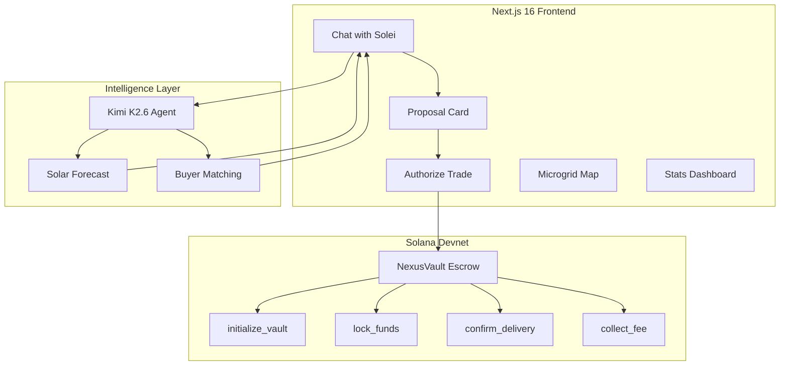

# ☀️ Lumos — Peer-to-Peer Solar Energy Marketplace

> **AI-powered decentralized energy trading on Solana.** Prosumers sell surplus solar energy directly to neighbors through an intelligent agent, with instant settlement and transparent pricing.

[](https://solana.com)
[](https://nextjs.org)
[](https://www.anchor-lang.com)
[](https://platform.moonshot.cn)
[](https://web.dev/progressive-web-apps/)
[](LICENSE)

---

## 🌍 The Problem

In Costa Rica, **87% of electricity** comes from renewable sources, yet solar prosumers can't sell surplus energy directly to their neighbors. The current model forces energy through centralized utilities, losing value at every step. Small producers have no market access, no dynamic pricing, and no transparency.

## 💡 Our Solution

**Lumos** creates a **peer-to-peer solar energy marketplace** where:

1. An **AI agent (Solei)** monitors your solar panels in real-time
2. When surplus is detected, Solei **finds the best buyer** in your neighborhood
3. The trade settles **instantly on Solana** through an escrow smart contract
4. You get paid in **USDC** — no intermediaries, no paperwork

---

## 🏗️ Architecture



---

## ✨ Key Features

### 🤖 Solei — AI Energy Agent
- **Natural language interface** in Spanish — chat to sell your energy
- Real-time meter data injection into every conversation
- **Solar production forecasting** with bell-curve model
- **Smart buyer matching** algorithm (proximity × demand × reliability)
- Proactive trade suggestions with timing advice

### ⛓️ NexusVault — Solana Escrow Program
- **5 on-chain instructions**: init, lock, confirm, cancel, collect
- PDA-based vault per trade with 15-minute timeout
- IoT meter reading verification
- 0.1% protocol fee — minimal friction
- Real Devnet transactions with Explorer verification

### 🗺️ Microgrid Map
- **Mapbox GL** visualization of prosumers and buyers
- Real-time node status (generating, consuming, trading)
- Live transaction feed overlay
- Geographic clustering for neighborhood matching

### 📊 Stats Dashboard
- Production vs. consumption charts
- ROI calculator for solar panel payback
- CO₂ avoidance certificate (downloadable)
- Leaderboard with neighbor rankings
- Price history with trend analysis

### 🎮 Gamification
- Daily login streak with progress bar
- Achievement badges (First Sale, 100 kWh, Top Neighbor)
- Weekly insight cards from Solei

---

## 🚀 Quick Start

### Prerequisites
- **Node.js 18+** and **npm**
- **Phantom Wallet** browser extension (for real wallet connection)

### 1. Clone & Install

```bash
git clone https://github.com/1N1-369/jubilant-winner.git
cd lumos
npm install
```

### 2. Configure Environment

```bash
cp .env.example .env.local
```

| Variable | Required | Description |
|----------|----------|-------------|
| `KIMI_API_KEY` | ✅ | [Moonshot AI](https://platform.moonshot.cn/) — powers Solei agent |
| `NEXT_PUBLIC_MAPBOX_TOKEN` | ✅ | [Mapbox](https://account.mapbox.com/) — microgrid map |
| `NEXT_PUBLIC_SOLANA_RPC_URL` | Optional | Defaults to Devnet |

> **Note:** Without API keys, the app runs in **Demo Mode** with realistic simulated data.

### 3. Run

```bash
npm run dev
```

Open [http://localhost:3000](http://localhost:3000) 🎉

### 4. (Optional) Intelligence Service

```bash
cd intelligence
pip install -r requirements.txt
python main.py
```

Adds TimesFM 2.5 solar forecasting + Graphify buyer matching on `localhost:8000`.

---

## 🧪 Tech Stack

| Layer | Technology | Purpose |
|-------|-----------|---------|
| **Frontend** | Next.js 16, React 19, TypeScript | App shell, routing, SSR |
| **State** | Zustand | Client state management |
| **Styling** | CSS Variables, Press Start 2P font | Pixel-art design system |
| **AI Agent** | Kimi K2.6 (OpenAI-compatible) | Streaming chat, intent detection |
| **Blockchain** | Solana Devnet, Anchor 0.30 | Escrow, settlement, verification |
| **Wallet** | Phantom (wallet-adapter-react) | Real wallet connection |
| **Map** | Mapbox GL JS | Microgrid visualization |
| **Intelligence** | Python FastAPI, bell-curve models | Forecast + matching |
| **PWA** | Service Worker, Web Manifest | Installable mobile app |
| **i18n** | Custom provider | Spanish / English |

---

## ⛓️ Smart Contract — NexusVault

Anchor program with 5 instructions for trustless energy escrow:

| Instruction | Description |
|-------------|-------------|
| `initialize_vault` | Create escrow PDA for a trade |
| `lock_funds` | Lock buyer's USDC into vault |
| `confirm_delivery` | Verify IoT meter reading, release funds |
| `cancel_trade` | Refund on timeout or manual cancel |
| `collect_fee` | Collect 0.1% protocol routing fee |

```
contracts/programs/nexus-vault/src/lib.rs  (291 lines)
```

---

## 🌱 Innovation: Why AI + Blockchain + Energy?

Most blockchain energy projects focus on **tokenization** — creating tokens that represent energy credits. Lumos takes a fundamentally different approach:

1. **AI-First UX**: The user never touches blockchain directly. Solei handles everything through natural conversation. The user says "sell my surplus" and Solei handles matching, pricing, and settlement.

2. **Real-Time Intelligence**: Unlike static order books, Solei uses solar production forecasting to advise **when** to sell (not just how much), optimizing revenue for the prosumer.

3. **Escrow-Based Settlement**: NexusVault creates a per-trade escrow with IoT verification. Funds are only released when the meter confirms energy delivery — trustless and verifiable.

4. **Designed for Emerging Markets**: The UI uses simple language, avoids crypto jargon, and speaks the prosumer's language (Spanish). The PWA works on any phone. The 0.1% fee makes micro-trades viable ($0.05 sales).

---

## 📁 Project Structure

```
lumos/
├── app/                         # Next.js App Router
│   ├── page.tsx                 # Landing page (parallax, ASCII shader)
│   ├── chat/page.tsx            # Chat with Solei
│   ├── map/page.tsx             # Microgrid map
│   ├── stats/page.tsx           # Dashboard + analytics
│   └── api/                     # Server routes
│       ├── solei/chat/          # Streaming SSE chat
│       ├── transaction/authorize/  # On-chain trade execution
│       └── microred/nodes/      # Map node data
├── components/                  # React components (50+ files)
│   ├── solei/                   # Chat UI, proposals, simulation
│   ├── landing/                 # Landing page sections
│   ├── map/                     # Mapbox markers and feed
│   ├── stats/                   # Charts, ROI, leaderboard
│   └── ui/                      # Design system (pixel-art)
├── lib/                         # Core business logic
│   ├── solei-ai.ts              # Kimi K2.6 streaming client
│   ├── intelligence.ts          # Forecast + matching
│   ├── solana.ts                # On-chain transaction flow
│   └── mock-data.ts             # Realistic demo data (CR grid)
├── contracts/                   # Anchor smart contract
│   └── programs/nexus-vault/    # NexusVault escrow program
├── intelligence/                # Python ML service
│   ├── forecaster.py            # Solar generation forecast
│   └── matcher.py               # Buyer matching algorithm
└── stores/                      # Zustand state management
```

---

## 📝 License

MIT — Hecho con ☀️ en Costa Rica
