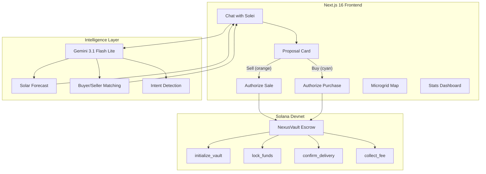

# ☀️ Lumos — Peer-to-Peer Solar Energy Marketplace

> **AI-powered bidirectional energy trading on Solana.** Buy or sell surplus solar energy directly with your neighbors through an intelligent agent, with instant settlement and transparent pricing.

[](https://solana.com)
[](https://nextjs.org)
[](https://www.anchor-lang.com)
[](https://ai.google.dev)
[](https://web.dev/progressive-web-apps/)
[](https://docs.docker.com/compose/)
[](LICENSE)

---

## 🌍 The Problem

In Costa Rica, **87% of electricity** comes from renewable sources, yet solar prosumers can't sell surplus energy directly to their neighbors. Consumers overpay for grid electricity when cheaper solar energy exists right next door. The current model forces energy through centralized utilities, losing value at every step — small producers have no market access, and neighbors have no way to buy local clean energy.

## 💡 Our Solution

**Lumos** creates a **bidirectional peer-to-peer solar energy marketplace** where:

1. An **AI agent (Solei)** monitors solar panels and grid demand in real-time
2. **Prosumers** with surplus energy get matched to the best buyer in their neighborhood
3. **Consumers** looking to buy clean energy get matched to the nearest, cheapest seller
4. Every trade settles **instantly on Solana** through an escrow smart contract
5. Payments in **USDC** — no intermediaries, no paperwork, no volatility

---

## 🏗️ Architecture



---

## ✨ Key Features

### 🤖 Solei — AI Energy Agent
- **Bilingual natural language interface** (Spanish & English) — chat to buy or sell energy
- Real-time meter data injection into every conversation
- **Dual intent detection**: recognizes both sell requests ("vender excedente") and buy requests ("quiero comprar energía")
- **Solar production forecasting** with bell-curve model
- **Smart matching** algorithm — finds buyers for sellers, and sellers for buyers
- Proactive trade suggestions with timing advice

### 🔄 Bidirectional Marketplace
- **Sell flow**: Prosumer has surplus → Solei finds best buyer → orange proposal card → authorize sale → USDC received
- **Buy flow**: Consumer needs energy → Solei finds nearest seller → cyan proposal card → authorize purchase → energy delivered
- Visual distinction between buy (cyan, cart icon) and sell (orange, lightbulb icon) proposals
- Savings calculator: shows consumer how much they save vs. the CNFL grid rate

### ⛓️ NexusVault — Solana Escrow Program
- **5 on-chain instructions**: init, lock, confirm, cancel, collect
- PDA-based vault per trade with 15-minute timeout
- IoT meter reading verification
- 0.1% protocol fee — minimal friction
- Real Devnet transactions with Explorer verification

### 🗺️ Microgrid Map
- **Mapbox GL** visualization of prosumers and buyers
- Real-time node status (generating, consuming, trading)
- Live transaction feed overlay
- Geographic clustering for neighborhood matching

### 📊 Stats Dashboard
- Production vs. consumption charts
- ROI calculator for solar panel payback
- CO₂ avoidance certificate (mintable as cNFT on Solana)
- Leaderboard with neighbor rankings
- Price history with trend analysis

### 🎮 Gamification
- Daily login streak with progress bar
- Achievement badges (First Sale, 100 kWh, Top Neighbor)
- Weekly insight cards from Solei

### 🌐 Internationalization (i18n)
- Full Spanish / English support across all UI, including:
  - Landing page, chat, proposals, transaction progress
  - PWA install prompt, footer, meter header
- Language toggle persisted in localStorage

---

## 🚀 Quick Start

### Prerequisites
- **Node.js 18+** and **npm**
- **Phantom Wallet** browser extension (for real wallet connection)

### 1. Clone & Install

```bash
git clone https://github.com/Syderal-IO/lumos.git
cd lumos
npm install
```

### 2. Configure Environment

```bash
cp .env.example .env.local
```

| Variable | Required | Description |
|----------|----------|-------------|
| `GEMINI_API_KEY` | ✅ | [Google AI Studio](https://ai.google.dev/) — powers Solei agent |
| `GEMINI_MODEL` | Optional | Defaults to `gemini-2.0-flash-lite` |
| `NEXT_PUBLIC_MAPBOX_TOKEN` | ✅ | [Mapbox](https://account.mapbox.com/) — microgrid map |
| `NEXT_PUBLIC_SOLANA_RPC_URL` | Optional | Defaults to Devnet |
| `SOLANA_PRIVATE_KEY` | Optional | For on-chain transaction signing |
| `INTELLIGENCE_URL` | Optional | Python ML service (`http://localhost:8000`) |

> **Note:** Without API keys, the app runs in **Demo Mode** with realistic simulated data.

### 3. Run

```bash
npm run dev
```

Open [http://localhost:3000](http://localhost:3000) 🎉

### 4. (Optional) Docker Compose

```bash
docker-compose up --build
```

Launches all services: Next.js frontend, Intelligence API, and contract build environment.

### 5. (Optional) Intelligence Service

```bash
cd intelligence
pip install -r requirements.txt
python main.py
```

Adds TimesFM 2.5 solar forecasting + Graphify buyer matching on `localhost:8000`.

---

## 🧪 Tech Stack

| Layer | Technology | Purpose |
|-------|-----------|---------|
| **Frontend** | Next.js 16, React 19, TypeScript | App shell, routing, SSR |
| **State** | Zustand | Client state management |
| **Styling** | CSS Variables, Press Start 2P font | Pixel-art design system |
| **AI Agent** | Gemini 3.1 Flash Lite (OpenAI-compatible) | Streaming chat, intent detection |
| **Blockchain** | Solana Devnet, Anchor 0.30 | Escrow, settlement, verification |
| **Wallet** | Phantom (wallet-adapter-react) | Real wallet connection |
| **Map** | Mapbox GL JS | Microgrid visualization |
| **Intelligence** | Python FastAPI, bell-curve models | Forecast + matching |
| **PWA** | Service Worker, Web Manifest | Installable mobile app |
| **i18n** | Custom React provider | Spanish / English |
| **DevOps** | Docker Compose, multi-stage builds | Containerized deployment |

---

## ⛓️ Smart Contract — NexusVault

Anchor program with 5 instructions for trustless energy escrow:

| Instruction | Description |
|-------------|-------------|
| `initialize_vault` | Create escrow PDA for a trade |
| `lock_funds` | Lock buyer's USDC into vault |
| `confirm_delivery` | Verify IoT meter reading, release funds |
| `cancel_trade` | Refund on timeout or manual cancel |
| `collect_fee` | Collect 0.1% protocol routing fee |

```
contracts/programs/nexus-vault/src/lib.rs  (291 lines)
```

---

## 🌱 Innovation: Why AI + Blockchain + Energy?

Most blockchain energy projects focus on **tokenization** — creating tokens that represent energy credits. Lumos takes a fundamentally different approach:

1. **AI-First UX**: The user never touches blockchain directly. Solei handles everything through natural conversation. Say "sell my surplus" or "I want to buy energy" and Solei handles matching, pricing, and settlement.

2. **Bidirectional Marketplace**: Unlike one-sided sell platforms, Lumos serves both prosumers and consumers — creating a true local energy market where anyone can participate.

3. **Real-Time Intelligence**: Unlike static order books, Solei uses solar production forecasting to advise **when** to sell (not just how much), and shows buyers how much they save vs. the grid rate.

4. **Escrow-Based Settlement**: NexusVault creates a per-trade escrow with IoT verification. Funds are only released when the meter confirms energy delivery — trustless and verifiable.

5. **Designed for Emerging Markets**: The UI uses simple language, avoids crypto jargon, and speaks the user's language (Spanish/English). The PWA works on any phone. The 0.1% fee makes micro-trades viable ($0.05 sales).

---

## 📁 Project Structure

```
lumos/
├── app/                         # Next.js App Router
│   ├── page.tsx                 # Landing page (parallax, ASCII shader)
│   ├── chat/page.tsx            # Chat with Solei (buy + sell)
│   ├── map/page.tsx             # Microgrid map
│   ├── stats/page.tsx           # Dashboard + analytics
│   └── api/                     # Server routes
│       ├── solei/chat/          # Streaming SSE chat (buy/sell intent)
│       ├── transaction/authorize/  # On-chain trade execution
│       └── microred/nodes/      # Map node data
├── components/                  # React components (50+ files)
│   ├── solei/                   # Chat UI, proposals, simulation
│   │   ├── chat-container.tsx   # Main chat with buy/sell state
│   │   └── proposal-card.tsx    # Color-coded proposal (orange/cyan)
│   ├── landing/                 # Landing page sections
│   ├── map/                     # Mapbox markers and feed
│   ├── stats/                   # Charts, ROI, leaderboard
│   └── ui/                      # Design system (pixel-art icons)
├── lib/                         # Core business logic
│   ├── solei-ai.ts              # Gemini streaming client + intent detection
│   ├── intelligence.ts          # Forecast + matching
│   ├── solana.ts                # On-chain transaction flow
│   ├── i18n.tsx                 # Bilingual translations (ES/EN)
│   ├── types.ts                 # Shared types (buy/sell SSE events)
│   └── mock-data.ts             # Realistic demo data (CR grid)
├── contracts/                   # Anchor smart contract
│   ├── programs/nexus-vault/    # NexusVault escrow program
│   └── Dockerfile               # Contract build environment
├── intelligence/                # Python ML service
│   ├── forecaster.py            # Solar generation forecast
│   ├── matcher.py               # Buyer matching algorithm
│   └── Dockerfile               # Intelligence service container
├── stores/                      # Zustand state management
├── Dockerfile                   # Next.js production container
└── docker-compose.yml           # Full stack orchestration
```

---

## 👥 Team

| | Name | Role |
|---|------|------|
| 🧑‍💼 | **Fabián** | CEO & Founder |
| 👨‍💻 | **Freddy** | CTO & Co-Founder |

Built with ☀️ from Costa Rica by [Syderal IO](https://github.com/Syderal-IO).

---

## 📝 License

MIT — Hecho con ☀️ en Costa Rica
